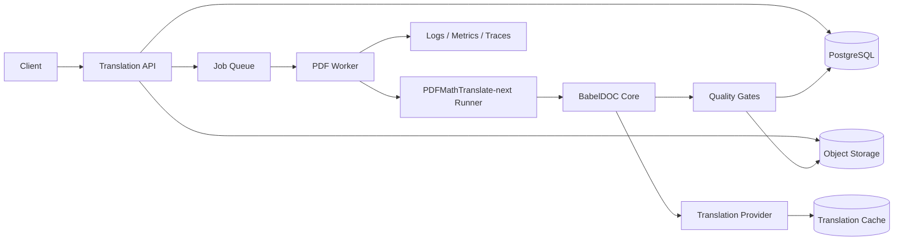
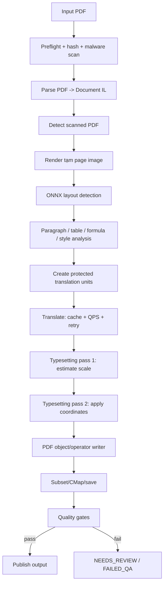

# All_to_PDF — Kiến trúc production dịch PDF giữ nguyên bố cục

**Trạng thái:** ĐÃ CHỌN / READY FOR IMPLEMENTATION  
**Phương án:** A — BabelDOC làm lõi PDF, PDFMathTranslate-next làm lớp tích hợp dịch và vận hành  
**Đối tượng đọc:** Backend developer, PDF/ML engineer, DevOps/SRE, QA  
**Cập nhật:** 2026-08-29

> Tài liệu này là bản thiết kế ngắn để triển khai production. Những mô tả về upstream đều trỏ tới commit, file và class/function cụ thể. Các ngưỡng hiệu năng hoặc chất lượng chưa được đo trên corpus của dự án được ghi **CHƯA XÁC MINH**.

---

## 1. Quyết định kiến trúc

Hệ thống sử dụng:

- **BabelDOC** làm PDF engine: parse PDF thành Document IL, nhận diện layout, tạo paragraph/formula/style, dàn lại chữ và sinh PDF.
- **PDFMathTranslate-next** làm lớp ứng dụng: translator adapter, cache, QPS/rate limit, cấu hình, subprocess isolation và progress event.
- **API bất đồng bộ + hàng đợi job** cho production; không giữ HTTP request mở trong toàn bộ thời gian dịch.
- **Object storage** lưu input/output; **PostgreSQL** lưu trạng thái job; **Redis-compatible queue** phân phối công việc.
- Chỉ phát hành output khi vượt qua quality gates. Output lỗi được giữ nội bộ để debug, không trả như kết quả thành công.

### Phiên bản upstream được khóa

| Thành phần | Commit tham chiếu | Vai trò |
|---|---|---|
| BabelDOC | [`38d3896dcde9b5a940c62cf5563cadea673a64d3`](https://github.com/funstory-ai/BabelDOC/commit/38d3896dcde9b5a940c62cf5563cadea673a64d3) | Lõi parse/layout/typeset/PDF writer |
| PDFMathTranslate-next | [`f8dffcf4c3a33b254391d43514439b975ce8d966`](https://github.com/PDFMathTranslate-next/PDFMathTranslate-next/commit/f8dffcf4c3a33b254391d43514439b975ce8d966) | Adapter dịch, cache, QPS, subprocess, CLI/config |

Không phụ thuộc trực tiếp vào `main`. Dependency phải được pin bằng tag/commit và chỉ nâng cấp sau regression test.

---

## 2. Phạm vi bản production đầu tiên

### Hỗ trợ

- PDF có text layer.
- Mặc định English → Vietnamese; thiết kế không khóa cứng cặp ngôn ngữ.
- Tài liệu một hoặc nhiều cột.
- Paragraph có rich text.
- Công thức inline/display được bảo vệ bằng object/placeholder của BabelDOC.
- Ảnh, vector và Form XObject được giữ dưới dạng PDF object thay vì raster hóa toàn trang.
- Output **mono PDF**; bilingual PDF không bật trong v1.
- Chạy theo job, có retry, cancellation, idempotency và audit log.

### Chưa nằm trong v1

- PDF scan không có text layer: trả `OCR_REQUIRED`, không âm thầm chạy OCR.
- Form PDF tương tác, chữ ký số và annotation phức tạp: `NEEDS_REVIEW` cho đến khi có corpus test.
- Dịch text trong hình ảnh.
- Table translation mặc định: giữ nguyên trong v1 nếu chưa có cell geometry đáng tin cậy.
- SLA, giới hạn trang, RAM và thời gian xử lý: **CHƯA XÁC MINH bằng benchmark chung**.

---

## 3. Sơ đồ hệ thống



### Nguyên tắc tiến trình

- Một worker container xử lý tối đa **một document tại một thời điểm** ở baseline.
- PDFMathTranslate-next chạy BabelDOC trong subprocess để cô lập crash và hỗ trợ cancellation; hành vi này nằm tại [`pdf2zh_next/high_level.py::_translate_wrapper`, `_translate_in_subprocess`, `do_translate_async_stream`](https://github.com/PDFMathTranslate-next/PDFMathTranslate-next/blob/f8dffcf4c3a33b254391d43514439b975ce8d966/pdf2zh_next/high_level.py).
- Song song request dịch sử dụng pool/QPS bên trong job; không tăng đồng thời cả document concurrency và translator concurrency trước benchmark.

---

## 4. Pipeline xử lý PDF



### Bảng truy vết pipeline

| Bước | Trách nhiệm | Upstream source được dùng | Quy tắc production |
|---|---|---|---|
| Orchestration | Chạy stage, split document, progress, memory monitor, fix CMap, save output | [`babeldoc/format/pdf/high_level.py::async_translate`, `do_translate`, `_do_translate_single`](https://github.com/funstory-ai/BabelDOC/blob/38d3896dcde9b5a940c62cf5563cadea673a64d3/babeldoc/format/pdf/high_level.py) | Pin commit; mono output; debug off; atomic publish |
| Document IL | Lưu page, character, paragraph, style, formula, curve, form, render order | [`document_il/il_version_1.py::{Document, Page, PdfParagraph, PdfCharacter, PdfFormula, PdfCurve, PdfForm}`](https://github.com/funstory-ai/BabelDOC/blob/38d3896dcde9b5a940c62cf5563cadea673a64d3/babeldoc/format/pdf/document_il/il_version_1.py) | IL là dữ liệu nội bộ, không phải DOCX |
| Layout | Render ảnh trang tạm và chạy ONNX để lấy bounding boxes | [`docvision/doclayout.py::OnnxModel.predict`, `handle_document`](https://github.com/funstory-ai/BabelDOC/blob/38d3896dcde9b5a940c62cf5563cadea673a64d3/babeldoc/docvision/doclayout.py); [`midend/layout_parser.py::LayoutParser.process`](https://github.com/funstory-ai/BabelDOC/blob/38d3896dcde9b5a940c62cf5563cadea673a64d3/babeldoc/format/pdf/document_il/midend/layout_parser.py) | Bitmap chỉ dùng cho inference; không raster hóa output toàn trang |
| Paragraph | Gom character theo layout, tách line, spacing và render order | [`midend/paragraph_finder.py::ParagraphFinder.process`, `process_page`](https://github.com/funstory-ai/BabelDOC/blob/38d3896dcde9b5a940c62cf5563cadea673a64d3/babeldoc/format/pdf/document_il/midend/paragraph_finder.py) | Lưu stable page/paragraph IDs trong metadata nội bộ của job |
| Formula/style | Nhận diện style, gắn character/curve/form vào formula | [`midend/styles_and_formulas.py::StylesAndFormulas.process`, `process_page`](https://github.com/funstory-ai/BabelDOC/blob/38d3896dcde9b5a940c62cf5563cadea673a64d3/babeldoc/format/pdf/document_il/midend/styles_and_formulas.py) | Formula placeholder integrity là hard gate |
| Translation | Tạo formula/rich-text placeholder, dịch paragraph bằng thread pool | [`midend/il_translator.py::ILTranslator.translate`, `process_page`, `translate_paragraph`](https://github.com/funstory-ai/BabelDOC/blob/38d3896dcde9b5a940c62cf5563cadea673a64d3/babeldoc/format/pdf/document_il/midend/il_translator.py) | Provider chính thức; cache; retry có phân loại; không log nội dung mặc định |
| Translator integration | Chọn translator, cache, rate limiter và tạo BabelDOC config | [`pdf2zh_next/high_level.py::create_babeldoc_config`](https://github.com/PDFMathTranslate-next/PDFMathTranslate-next/blob/f8dffcf4c3a33b254391d43514439b975ce8d966/pdf2zh_next/high_level.py); [`pdf2zh_next/translator/`](https://github.com/PDFMathTranslate-next/PDFMathTranslate-next/tree/f8dffcf4c3a33b254391d43514439b975ce8d966/pdf2zh_next/translator) | API key từ secret manager; QPS theo provider; idempotent cache key |
| Typesetting | Hai pass: tìm `optimal_scale`, sau đó áp dụng line break/toạ độ; dùng R-tree tìm paragraph lân cận | [`midend/typesetting.py::Typesetting.preprocess_document`, `_find_optimal_scale_and_layout`, `render_page`, `render_paragraph`](https://github.com/funstory-ai/BabelDOC/blob/38d3896dcde9b5a940c62cf5563cadea673a64d3/babeldoc/format/pdf/document_il/midend/typesetting.py) | Patch ngưỡng đọc được; không chấp nhận scale 0.1 làm output thành công |
| PDF writer | Tạo text operators, Form/XObject/curve theo `render_order` | [`backend/pdf_creater.py::PDFCreater`, `RenderUnit`, `CharacterRenderUnit`, `FormRenderUnit`](https://github.com/funstory-ai/BabelDOC/blob/38d3896dcde9b5a940c62cf5563cadea673a64d3/babeldoc/format/pdf/document_il/backend/pdf_creater.py) | Ghi file tạm, validate, rồi rename/upload atomically |

---

## 5. Các thay đổi bắt buộc trước production

### 5.1 Readability guard

BabelDOC hiện đặt `min_scale = 0.1` trong `Typesetting._find_optimal_scale_and_layout`. Đây là fail-safe chống overflow nhưng có thể tạo chữ gần như không đọc được.

**Quyết định:** thêm cấu hình riêng của dự án:

```text
MIN_READABLE_SCALE = 0.70
```

Hành vi:

1. Thử typeset theo thuật toán upstream.
2. Nếu scale cuối `< MIN_READABLE_SCALE`, không publish paragraph đó như bình thường.
3. Fallback theo thứ tự:
   - mở rộng box nếu R-tree xác nhận không va chạm;
   - dùng source text trong box gốc;
   - nếu vùng bắt buộc phải dịch, đánh dấu `NEEDS_REVIEW`.
4. Ghi metric `paragraph_scale`, `source_fallback_count` và reason code.

Ngưỡng `0.70` là baseline sản phẩm, **CHƯA XÁC MINH** trên corpus thực tế và phải điều chỉnh sau benchmark.

### 5.2 Không chạy output variants không cần thiết

Cấu hình v1:

```yaml
no_dual: true
no_mono: false
debug: false
watermark_output_mode: no_watermark
auto_extract_glossary: false
translate_table_text: false
```

- Tắt bilingual để giảm save/merge/I/O.
- Tắt debug artifact.
- Tắt auto glossary ở baseline để tránh thêm lượt gọi model; chỉ bật khi benchmark chứng minh lợi ích.
- Table text giữ nguyên cho đến khi test coverage đủ.

Các option được truyền từ PDFMathTranslate-next sang `BabelDOCConfig` tại [`create_babeldoc_config`](https://github.com/PDFMathTranslate-next/PDFMathTranslate-next/blob/f8dffcf4c3a33b254391d43514439b975ce8d966/pdf2zh_next/high_level.py).

### 5.3 Cache cấp production

Cache upstream có thể dùng cho một tiến trình/local runtime. Production cần cache chia sẻ:

```text
cache_key = SHA256(
  normalized_source_text
  + source_lang
  + target_lang
  + provider
  + model
  + glossary_version
  + prompt_version
  + placeholder_schema_version
)
```

Không dùng bản dịch cache nếu placeholder validation thất bại. Không cache lỗi provider hoặc content-filter response.

### 5.4 Giới hạn tài nguyên

- Chia tài liệu bằng `max_pages_per_part` để giới hạn peak RAM; BabelDOC hỗ trợ split strategy trong `high_level.py::do_translate`.
- Worker container có memory/CPU/time limit.
- Process bị timeout phải bị kill toàn bộ process group và job có thể retry từ đầu bằng cùng idempotency key.
- Giá trị giới hạn cụ thể: **CHƯA XÁC MINH**, lấy từ benchmark p95 chứ không đoán theo số trang đơn thuần.

---

## 6. Cấu trúc source code đề xuất

```text
All_to_PDF/
├── README.md
├── pyproject.toml
├── src/all_to_pdf/
│   ├── api/
│   │   ├── routes.py
│   │   └── schemas.py
│   ├── domain/
│   │   ├── job.py
│   │   └── quality.py
│   ├── application/
│   │   ├── submit_job.py
│   │   ├── run_translation.py
│   │   └── publish_result.py
│   ├── adapters/
│   │   ├── babeldoc_runner.py
│   │   ├── pdf2zh_config.py
│   │   ├── translation_cache.py
│   │   ├── object_storage.py
│   │   └── job_repository.py
│   ├── quality/
│   │   ├── structural.py
│   │   ├── geometry.py
│   │   ├── placeholders.py
│   │   └── visual.py
│   └── observability/
│       ├── logging.py
│       └── metrics.py
├── patches/
│   └── babeldoc-readable-scale.patch
├── tests/
│   ├── unit/
│   ├── integration/
│   └── corpus/
│       ├── manifest.yaml
│       └── expected/
└── deploy/
    ├── Dockerfile.api
    ├── Dockerfile.worker
    └── compose.yaml
```

### Ranh giới module

- `api`: xác thực, upload/presigned URL, tạo job, trả status; không xử lý PDF.
- `application`: state machine và orchestration của hệ thống riêng.
- `babeldoc_runner`: adapter duy nhất được phép import/call PDFMathTranslate-next/BabelDOC.
- `quality`: không phụ thuộc provider dịch; chỉ đọc source/output/report.
- `patches`: mọi thay đổi upstream phải tồn tại dưới dạng patch có test, không sửa thủ công trong site-packages.

---

## 7. API và state machine tối thiểu

### API

```http
POST /v1/pdf-translations
GET  /v1/pdf-translations/{job_id}
POST /v1/pdf-translations/{job_id}/cancel
GET  /v1/pdf-translations/{job_id}/artifacts/output
GET  /v1/pdf-translations/{job_id}/quality-report
```

Request tạo job cần có:

```json
{
  "input_object_key": "uploads/.../input.pdf",
  "source_language": "en",
  "target_language": "vi",
  "translator_profile": "production-default",
  "quality_profile": "balanced",
  "glossary_version": null,
  "idempotency_key": "client-generated-key"
}
```

### Trạng thái job

```text
UPLOADED
  -> QUEUED
  -> PREFLIGHT
  -> PARSING
  -> TRANSLATING
  -> TYPESETTING
  -> GENERATING_PDF
  -> QUALITY_CHECK
  -> SUCCEEDED

Nhánh lỗi:
  -> OCR_REQUIRED
  -> NEEDS_REVIEW
  -> FAILED_RETRYABLE
  -> FAILED_PERMANENT
  -> CANCELLED
```

Cập nhật state phải dùng compare-and-set hoặc transaction để tránh hai worker publish cùng một job.

---

## 8. Quality gates

Output chỉ được chuyển sang `SUCCEEDED` khi tất cả hard gate đạt.

### Hard gates

1. Output mở được bằng ít nhất PyMuPDF và một parser độc lập.
2. Số trang bằng source, trừ khi request chỉ định page subset.
3. MediaBox/CropBox của mỗi trang không đổi ngoài tolerance cấu hình.
4. Formula/rich-text placeholder không mất, không thừa, không đổi thứ tự bất hợp lệ.
5. Không paragraph nào có scale dưới `MIN_READABLE_SCALE`, trừ vùng được fallback về source.
6. Không có text box vượt page boundary.
7. Số ảnh/Form XObject/link giảm bất thường phải làm job fail hoặc `NEEDS_REVIEW`.
8. Output không rỗng, không encrypted ngoài dự kiến, không mang trạng thái save dở.

### Risk-based visual QA

Không render pixel-diff toàn bộ trang ở chế độ mặc định. Chỉ render:

- trang có paragraph scale thấp;
- trang có formula/table;
- trang có text chồng image/figure;
- trang có collision/box expansion;
- mẫu ngẫu nhiên theo tỷ lệ cấu hình.

Các ngưỡng pixel difference, collision tolerance và coverage target: **CHƯA XÁC MINH** cho đến khi có corpus chuẩn.

### Báo cáo quality

```json
{
  "job_id": "...",
  "pages": 42,
  "translated_paragraphs": 310,
  "source_fallback_paragraphs": 4,
  "minimum_scale": 0.74,
  "placeholder_errors": 0,
  "overflow_errors": 0,
  "risky_pages": [3, 17, 21],
  "visual_qa_passed": true
}
```

---

## 9. Retry và failure policy

| Lỗi | Retry | Kết quả |
|---|---:|---|
| Provider timeout/429/5xx | Có, exponential backoff + jitter | `FAILED_RETRYABLE` khi hết budget |
| Placeholder mismatch | Retry bản dịch tối đa giới hạn nhỏ; sau đó fallback source/review | Không publish text hỏng |
| PDF parse lỗi có thể repair | Một lần bằng repair path của engine | Fail permanent nếu vẫn lỗi |
| Worker OOM/crash | Job retry trên worker mới, giới hạn attempt | Không tiếp tục từ file tạm không xác thực |
| Scanned PDF | Không retry cùng pipeline | `OCR_REQUIRED` |
| Scale dưới ngưỡng | Không retry provider nếu nội dung dịch hợp lệ | Mở rộng box, source fallback hoặc review |
| Quality gate fail | Không publish | `NEEDS_REVIEW` hoặc `FAILED_PERMANENT` |

Mỗi attempt dùng working directory riêng. Artifact tạm có TTL và không được ghi đè output đã publish.

---

## 10. Observability bắt buộc

### Metrics

```text
job_duration_seconds{stage,status}
pdf_pages_total
pdf_peak_memory_bytes
layout_inference_seconds
translation_requests_total{provider,model,status}
translation_cache_hit_ratio
translation_tokens_total{provider,model,type}
paragraph_scale_histogram
source_fallback_paragraphs_total
placeholder_validation_failures_total
qa_failures_total{gate}
worker_crashes_total{reason}
```

BabelDOC đã có stage progress và `MemoryMonitor`; source tại [`high_level.py::TRANSLATE_STAGES`, `async_translate`, `MemoryMonitor`](https://github.com/funstory-ai/BabelDOC/blob/38d3896dcde9b5a940c62cf5563cadea673a64d3/babeldoc/format/pdf/high_level.py). Adapter của dự án phải chuyển event đó thành metrics/traces của hệ thống.

### Logging

- Log JSON có `job_id`, `attempt`, `page`, `stage`, `provider`, `upstream_commit`.
- Không log toàn văn paragraph hoặc API key.
- Cho phép debug content có kiểm soát bằng feature flag, access audit và TTL ngắn.

---

## 11. Security và dữ liệu

- Coi mọi PDF là input không tin cậy.
- Worker chạy non-root, read-only root filesystem, working volume riêng, không mount Docker socket.
- Network egress chỉ tới object storage, queue/DB và translation provider được allowlist.
- Giới hạn kích thước file, số trang, decompressed object size, CPU, RAM và thời gian.
- Malware scan trước khi đưa vào worker.
- API key chỉ lấy từ secret manager.
- Input/output mã hóa khi truyền và khi lưu; retention theo cấu hình tenant.
- Không gửi metadata hoặc text vượt nhu cầu tới provider.

---

## 12. License gate

BabelDOC và PDFMathTranslate-next tại các commit được chọn đều chứa giấy phép **GNU AGPL-3.0**:

- [BabelDOC LICENSE](https://github.com/funstory-ai/BabelDOC/blob/38d3896dcde9b5a940c62cf5563cadea673a64d3/LICENSE)
- [PDFMathTranslate-next LICENSE](https://github.com/PDFMathTranslate-next/PDFMathTranslate-next/blob/f8dffcf4c3a33b254391d43514439b975ce8d966/LICENSE)

**Release gate:** phải có xác nhận pháp lý về nghĩa vụ AGPL đối với deployment qua mạng, bản fork/patch và cách cung cấp source tương ứng. Tài liệu này không thay thế tư vấn pháp lý.

---

## 13. Deployment baseline

```text
API replicas: stateless, autoscale theo request
Worker replicas: autoscale theo queue depth
Worker concurrency: 1 document/container ở baseline
DB: PostgreSQL
Queue: Redis-compatible hoặc broker tương đương
Artifacts: S3-compatible object storage
Observability: OpenTelemetry + metrics/log backend
```

Container worker phải chứa đúng:

```text
all_to_pdf application commit
BabelDOC commit
PDFMathTranslate-next commit
layout model checksum
font bundle checksum
prompt version
quality-rules version
```

Các giá trị này được ghi vào job report để tái lập kết quả.

---

## 14. Kế hoạch triển khai

### Giai đoạn 1 — Functional baseline

- Tạo API/job model/object storage.
- Tạo `babeldoc_runner` gọi PDFMathTranslate-next subprocess.
- Pin hai upstream commit.
- Mono PDF, English → Vietnamese.
- Hard gate: open/page count/box/placeholder/overflow.

### Giai đoạn 2 — Production hardening

- Áp dụng readability guard và source fallback.
- Shared translation cache.
- Resource limit, timeout, cancellation, retry.
- Risk-based visual QA.
- Metrics/tracing/dashboard.

### Giai đoạn 3 — Benchmark và rollout

- Corpus tối thiểu: single-column, multi-column, tables, inline/display formulas, rotated text, text-over-image, Form XObject, subset fonts, long document và scanned PDF.
- So sánh source/output bằng structural + geometry + selective pixel diff.
- Chạy shadow traffic trước; chưa tự động publish cho đến khi đạt acceptance criteria.

---

## 15. Acceptance criteria trước production

Các ngưỡng số phải được khóa sau benchmark; trạng thái hiện tại là **CHƯA XÁC MINH**. Tối thiểu phải chứng minh:

- Không mất trang, ảnh, formula hoặc link trên corpus chuẩn.
- Placeholder integrity đạt 100% với output được publish.
- Không output nào có paragraph dưới ngưỡng đọc được mà không có reason/fallback.
- Job retry không tạo output trùng hoặc publish file dở.
- Peak RAM và p95 latency nằm trong giới hạn hạ tầng đã duyệt.
- Regression suite chạy lại khi thay upstream commit, font, layout model, prompt hoặc provider model.
- Legal gate AGPL hoàn tất trước cung cấp dịch vụ qua mạng.

---

## 16. Tóm tắt cho developer

```text
PDFMathTranslate-next = lớp vận hành và translator integration
BabelDOC              = lõi hiểu, dàn lại và tạo PDF
Document IL           = bản đồ object/toạ độ nội bộ, không phải Word
Bitmap                 = chỉ dùng tạm cho layout inference
Typesetter             = tìm scale, xuống dòng và đặt lại character/formula
PDF Creator            = sinh lại PDF object/operator theo render_order
Production additions   = readable-scale guard + QA + queue + storage + observability
```

Nguyên tắc quan trọng nhất:

> Không coi “PDF sinh được” là thành công. Chỉ publish khi bản dịch, khả năng đọc, cấu trúc PDF và bảo toàn layout đều vượt qua quality gates.
